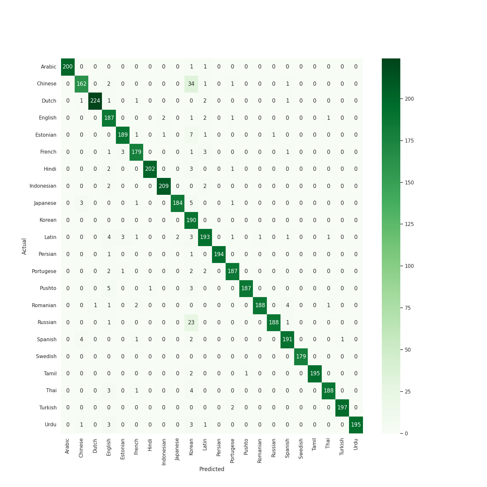

# Lab Deliverable 1: Language Detection

_Mining Unstructured Data, Master in Data Science, Barcelona School of Informatics_

Javier Herrer Torres (javier.herrer.torres@estudiantat.upc.edu)
Ignacio Lloret Lorente (ignacio.lloret@estudiantat.upc.edu)

---

[GitHub repository](https://github.com/IgnacioLL/langdetection)

## Introduction

Language detection is a common and useful task in natural language processing (NLP), which involves identifying the language of a given text from a set of possible languages. Language detection can be applied to various domains and applications, such as machine translation, text analysis, document retrieval, and multilingual communication. However, language detection also poses several challenges and difficulties, such as dealing with unstructured data, handling multiple languages and scripts, choosing appropriate features and models, and evaluating the performance and errors of the system.

In this report, we will explore the task of language detection using a dataset of 21859 sentences written in 22 languages, including several language families and writing scripts. We will follow a tutorial that provides a basic system for language detection using a naive Bayes classifier and frequency count features. We will also perform two exercises to modify and improve the system, by experimenting with different parameters, preprocessing steps, and classifier models. Our goal is to become familiar with NLP data and the additional challenges we may find compared to tasks based on structured data. We will also compare and analyze the results of the different systems, explaining the differences in performance and the kind of errors observed.

## First baseline

**Explain the error patterns shown at character and word level**

The main reason why they show different error patterns is that they use different levels of granularity and different features to represent the text. The character level model uses sequences of characters as features, which can capture the orthographic and morphological features of different languages, but may not capture the lexical and semantic features. The word level model uses sequences of words as features, which can capture the lexical and semantic features of different languages, but may not capture the orthographic and morphological features. Therefore, the character level model is better at identifying languages that have distinct writing systems, while the word level model is better at identifying languages that have distinct vocabularies.


**How well does the vocabolary cover the data?**

Only 25% of the tokens in the text are also in the vocabulary, and the remaining 75% are unknown or out-of-vocabulary tokens. This implies that the vocabulary is too small or too specific to capture the diversity and variability of the text, and the language detector may have difficulties in identifying the language correctly.

**Which languages produce more errors? What do they have in common (family, script, etc)?**

As shown in the confusion matrix, languages from a common origin (asiatic, latin...) often produce more errors as they share similar vocabulary. It's been also observed some of the errors are due to cross language references or citations.


**How languages overlap on the PCA plot? What could that overlapping mean?**

Although the PCA first two dimensiones do not capture a high percentage variance as first dimension captures 7.8\% and the second one captures 3.6\%, the PCA plot is pretty shows clear trends. Languages with similar alphabets overlapped. For example:
- In the upper right corner Thai, Hindi and Tamil.
- Below, Korean and Japanese.
- In the left hand side, european languages (Spanish, English, French, Portuguese...).
- In the lower right corner, arabic languages (Urdu, Arabic and Pushto).


## Preprocess

### Sentence splitting and tokenization

This preprocessing method splits each word of the sentences into a different record. Of course, repeating the same language label for each. Cross language references in sentences will now be split in one record each **assigning a wrong language**. In result, the training set will now contain a considerable number of misstagged records.

The results of this function are two series of preprocessed data that can be used as features and labels for the classifier. The function splits the sentences into words, which can capture the lexical and morphological features of different languages. The function also removes the punctuation marks, which can reduce the noise and sparsity of the data.

### Alphabet discrimination

This preprocessing method detects the most used alphabet being used taking 10 random characters from the sentence and deleting all characters which do not coincide with the same alphabet except the blank space. 

### Number removal

We also remove all numbers as they are not language specific and are not very useful and may create noise in the model. 

### Character splitting

As seen in the baseline confusion matrix the worst language to be predicted is Chinese/Japanese. We consider that if it is a ideogram language this should be taken in to account and take each letter as if it was a complete word. Therefore if a sentence has less than 5\% of blanks in the sentence we will divide this sentence character by character. 

## Classifiers

### Ranfom Forest

Random forest is a machine learning technique that builds a "forest" out of many individual "decision trees." Each tree learns by making a series of yes-or-no decisions based on different features of the data (like word frequency or character patterns). In language detection, these features could analyze things like character sets, grammatical structures, or common word usage as is our case. Finally, the random forest combines the predictions of all the trees, making it more robust and adaptable to the complexities of identifying different languages.


### Xgboost classifier

XGBoost, similar to random forest, is an ensemble technique. It builds a series of sequential models in our case decision trees that focus on improving upon the weaknesses of previous models in the sequence. For language detection, XGBoost can analyze features like character n-grams or word frequencies, iteratively refining its predictions to identify the most likely language. This focus on correcting errors makes XGBoost potentially well-suited for the nuanced task of language classification.

## Code

### Preprocess - Sentence splitting

The main functions used are `.split(r'[^\w\s]')` which returns a list of words for each sentence, and `.explode(...)` which transforms each element of a list-like to a row, replicating index values.

```python
def _split_sentences(
    sentence: pd.Series,
    labels: pd.Series
) -> tuple[pd.Series, pd.Series]:
    df = (pd.DataFrame({"sentence": sentence, "language": labels})
          .assign(sentence=lambda df_: df_.sentence.astype(str).str.split(r'[^\w\s]'))
          .explode(column="sentence"))
    return df.sentence, df.language
```

### Preprocess - Alphabet discrimination

```python
def _delete_minority_alphabet(sentence):
    alphabets = ['greek', 'cyrillic', 'latin', 'arabic', 'hebrew', 'cjk',
                 'hangul', 'hiragana', 'katakana', 'thai']
    random_letters = random.sample(sentence, min(len(sentence), 10))
    alphabet_counts = {alphabet: sum(getattr(ad, f'is_{alphabet}')(letter) 
                       for letter in random_letters) for alphabet in alphabets}
    majority_alphabet = max(alphabet_counts, key=alphabet_counts.get)
    filtered_letters = [letter for letter in sentence 
                        if getattr(ad, f'is_{majority_alphabet}')(letter) or letter == " "]
    return "".join(filtered_letters)
```

### Preprocess - Number removal

```python
def _remove_numbers(text):
  no_digits = "".join(char for char in text if not char.isdigit())
  return no_digits
```

### Preprocess - Character splitting

```python
def _split_sentences_in_characters(text: str, characters_sep: int=2):
    if _count_number_blancks(text, threshold=.05): 
        result = [text[i:i+2] for i in range(0, len(text), characters_sep)]
        result_splitted = " ".join(result)
        return result_splitted
    else: 
        return text

def _count_number_blancks(text: str, threshold: float) -> bool:
    counter = text.count(' ')
    return (counter/len(text)) < threshold
```

### Classifier - Random forest

```python
def applyRandomForest(X_train, y_train, X_test):
    trainArray = toNumpyArray(X_train)
    testArray = toNumpyArray(X_test)
    
    clf = RandomForestClassifier()
    clf.fit(trainArray, y_train)
    y_predict = clf.predict(testArray)
    return y_predict
```

### Classifier - Xgboost

```python
def applyXgboost(X_train, y_train, X_test): 
    trainArray = toNumpyArray(X_train)
    testArray = toNumpyArray(X_test)
    label_mapping, reverse_mapping = _create_mappings(y_train)
    # Use the dictionary to convert string labels to numeric values
    y_numeric = [label_mapping[label] for label in y_train]
    clf = XGBClassifier()
    clf.fit(trainArray, y_numeric)
    y_predict = clf.predict(testArray)
    # Use the dictionary to convert numeric labels to string values
    y_predict_string = [reverse_mapping[idx] for idx in y_predict]
    return y_predict_string
```

## Experiments and results

### Preprocess - Sentence splitting

Splitting sentences by `[^\w\s]` regular expression isn't a good preprocessing method as there's no universal regular expression for this purpose. Thus, the matrix shows low performance on the following languages. Hindi and Urdu, which use complex ligatures or conjuncts to combine two or more characters into a single glyph. Thai and Vietnamese, use diacritical marks or tone marks to modify the pronunciation or meaning of the characters. Chinese and Japanese, do not use spaces or punctuation marks to separate words or sentences. Arabic, have different writing systems and scripts, such as the Arabic script and the Arabic numerals.


### Preprocess - Alphabet discrimination

Detecting the language and deleting all the non-equal alphabet characters degrades performance considerably. Specially in the hindi, tamil, japanese and chinese. As we don't understand the language and the posible variations is hard to determine why is it failing. We won't use it. 


### Preprocess - Number removal

Removing all numbers does not have an impact in the models ability to classify it. 


### Preprocess - Character splitting

Splitting the sentences in characters if 5\% of the characters are different than blank space has a great impact on the result. Over 4 points of F1 score an clearly improving the confusion matrix for ideogram-kind languages. 


### Classifier - Random Forest

Applying a Random Forest instead of an Naive Bayes model improves considerably the performance as expected. We can see great improvements when predicting a japanese without mixing it with swedish. Differentiating between Japanese and chinese remains a challenge. 


### Classifier - Xgboost

Applying a Xgboost instead of an Naive Bayes model improves considerably the performance but not the random forest one but the application gets considerably worse. We can see very similar results as the random forest approach. They are very similar algorithms so it was expected. 




## Conclusions

In this report, we have explored the task of language detection using a dataset of 21859 sentences written in 22 languages. We have followed a tutorial that provides a basic system for language detection using a naive Bayes classifier and frequency count features. We have also performed two exercises to modify and improve the system, by experimenting with different parameters, preprocessing steps, and classifier models.
Some of the main conclusions and insights we have gained from this task are:
- Language detection is a challenging and complex task that requires dealing with unstructured data, handling multiple languages and scripts, choosing appropriate features and models, and evaluating the performance and errors of the system.
- The vocabulary size and granularity affect the coverage and representation of the data. A small or specific vocabulary may not capture the diversity and variability of the text, and may result in many unknown or out-of-vocabulary tokens. A word-level granularity may not capture the orthographic and morphological features of different languages, and may result in overfitting and poor generalization.
- The preprocessing steps can improve or degrade the performance of the system, depending on the data, the features, and the algorithm. Some preprocessing steps, such as sentence splitting, alphabet discrimination, or number removal, may not be suitable or effective for all languages and alphabets. Some preprocessing steps, such as normalization, filtering, or vectorization, may reduce the noise and sparsity of the data, and capture the lexical and semantic features of different languages.
- The classifier models can have different strengths and weaknesses, depending on the data, the features, and the algorithm. Some classifier models, such as naive Bayes, may be simple and fast, but may make strong assumptions and ignore the dependencies among the features. Some classifier models, such as random forest or XGBoost, may be robust and adaptable, but may require more computation and memory, and may be prone to overfitting or bias.
- The performance and errors of the system can be measured and analyzed using different metrics and plots, such as accuracy, precision, recall, f1-score, confusion matrix, and PCA plot. These tools can help us understand how well the system can correctly identify the language of a given text, and which languages are most confused or misclassified by the system.
